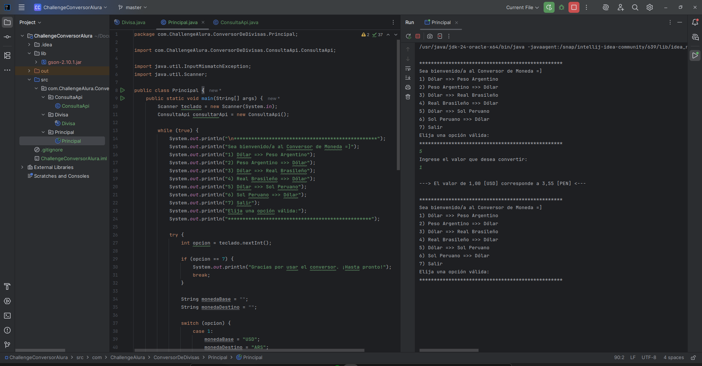

# 💹 Conversor de Moneda - Challenge ONE G8

## 📋 Descripción del Proyecto

Este proyecto es la solución al **Challenge de Backend: Conversor de Moneda**, desarrollado como parte de la **Generación 8** del programa **Oracle Next Education (ONE)** en colaboración con **Alura Latam**.

El objetivo fue construir una aplicación de consola en Java, aplicando los principios de la **Programación Orientada a Objetos**. El conversor interactúa en tiempo real con una API de tasas de cambio para realizar conversiones de divisas de manera precisa y actualizada.

----------

## ✨ Características Principales

-   **Conversión en Tiempo Real:** Se conecta a la API ExchangeRate-API para obtener las tasas de cambio más recientes, asegurando la precisión de los cálculos.
    
-   **Interfaz de Consola Interactiva:** Un menú simple y claro guía al usuario, permitiendo realizar múltiples conversiones de forma continua hasta que decida salir.
    
-   **Manejo de Divisas Múltiples:** Soporta conversiones entre los siguientes pares de monedas (Viciversa):
    
    -   🇺🇸 Dólar Americano (USD) ↔ 🇦🇷 Peso Argentino (ARS)
        
    -   🇺🇸 Dólar Americano (USD) ↔ 🇧🇷 Real Brasileño (BRL)
        
    -   🇺🇸 Dólar Americano (USD) ↔ 🇵🇪 Sol Peruano (PEN)
        
-   **Código Robusto y Seguro:**
    
    -   **Manejo de Errores:** Valida las entradas del usuario para prevenir fallos por datos no numéricos o negativos.
        
    -   **Gestión de Excepciones:** Controla posibles errores de conexión o de respuesta de la API para evitar que la aplicación se interrumpa inesperadamente.
        
-   **Diseño Orientado a Objetos:** El código está estructurado en paquetes (Principal, ConsultaApi, Divisa) para una clara separación de responsabilidades, facilitando su mantenimiento y escalabilidad.
    

----------

## 🛠️ Tecnologías Utilizadas

**Java (JDK 17)**

Lenguaje principal para toda la lógica de la aplicación.

**Biblioteca Gson**

Para deserializar eficientemente la respuesta JSON de la API a objetos Java (record).

**Java HttpClient**

Para realizar solicitudes HTTP a la API de forma nativa y asíncrona.

**IntelliJ IDEA**

Entorno de desarrollo utilizado para la codificación, depuración y gestión del proyecto.

----------

## ⚙️ Instalación y Uso

Para ejecutar este proyecto en tu entorno local, sigue estos sencillos pasos:

1.  **Clonar el repositorio:**
    
    code Bash
    
    downloadcontent_copyexpand_less
    
          `git clone https://github.com/jhonyaldo/g8conversormonedasjr.git
    cd g8conversormonedasjr`
        
    
2.  **Abrir en tu IDE:**
    
    -   Abre el proyecto desde IntelliJ IDEA o tu IDE de Java preferido. El archivo ChallengeConversorAlura.iml debería configurar las dependencias automáticamente.
        
3.  **⚠️ Configurar la API Key:**
    
    -   Este proyecto requiere una clave de la **ExchangeRate-API**. Puedes obtener una gratuita en su [sitio web](https://www.google.com/url?sa=E&q=https%3A%2F%2Fwww.exchangerate-api.com%2Fsignup).
        
    -   Abre el archivo src/com/ChallengeAlura/ConversorDeDivisas/ConsultaApi/ConsultaApi.java.
        
    -   Localiza la variable apiKey y reemplaza el valor de ejemplo con tu clave personal.
        
  
        
              `String apiKey = "TU_API_KEY_PERSONAL_AQUI";`
            
        
4.  **Ejecutar la Aplicación:**
    
    -   Navega hasta el archivo src/com/ChallengeAlura/ConversorDeDivisas/Principal/Principal.java.
        
    -   Ejecuta el método main() para iniciar el conversor en tu consola.
        

----------

## 📂 Estructura del Proyecto

El proyecto sigue una arquitectura limpia para separar las responsabilidades:

      `/src
└── com/ChallengeAlura/ConversorDeDivisas
    ├── ConsultaApi/
    │   └── ConsultaApi.java   # -> Lógica para conectar y consumir la API externa.
    ├── Divisa/
    │   └── Divisa.java        # -> Record para modelar los datos de la respuesta JSON.
    └── Principal/
        └── Principal.java     # -> Lógica principal, interfaz de usuario y punto de entrada.`
    

----------

## 👨‍💻 Autor

**Jhony A. Rodriguez Melendez**

-   **Correo:**  [jhonyaldo@gmail.com](https://www.google.com/url?sa=E&q=mailto%3Ajhonyaldo%40gmail.com)
    
-   **LinkedIn:**  [https://www.linkedin.com/in/jhonyrm/](https://www.google.com/url?sa=E&q=https%3A%2F%2Fwww.linkedin.com%2Fin%2Fjhonyrm%2F)
    
-   **GitHub:**  [https://github.com/jhonyaldo](https://www.google.com/url?sa=E&q=https%3A%2F%2Fgithub.com%2Fjhonyaldo)
    

----------

